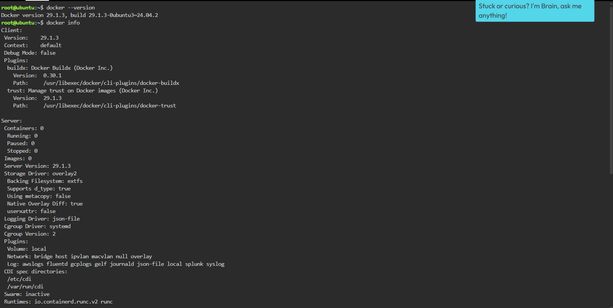
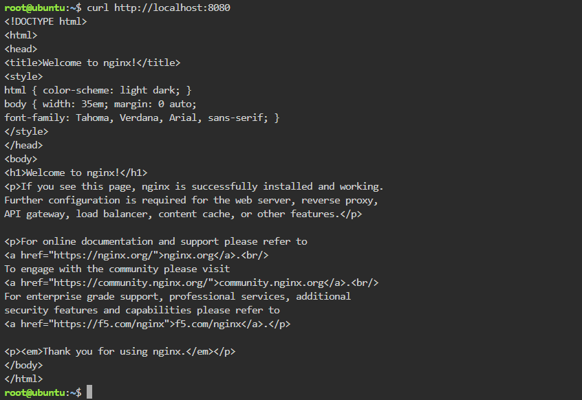

# Docker Deployment & Container Lifecycle Documentation

## Docker Commands Executed and Descriptions

### Docker Environment Verification

1. `docker --version`
   - **Explanation:** Displays the installed Docker version and confirms that Docker is available in the KillerCoda environment.

2. `docker info`
   - **Explanation:** Displays detailed information about the Docker environment and verifies that the Docker engine is running properly.

### Nginx Container Deployment

3. `docker pull nginx`
   - **Explanation:** Downloads the official Nginx image from Docker Hub so it can be used to create an Nginx container.

4. `docker run -d -p 8080:80 --name my-nginx-server nginx`
   - **Explanation:** Creates and runs the Nginx container in detached mode, mapping port `8080` on the host to port `80` inside the container.

5. `docker ps`
   - **Explanation:** Displays all active, currently running containers and shows information such as the container ID, image, status, and port mapping.

6. `curl http://localhost:8080`
   - **Explanation:** Sends an HTTP request to the Nginx web server through port `8080` and verifies that the containerized web server is working correctly.

## Container Lifecycle Commands

7. `docker ps`
   - **Explanation:** Displays all active, currently running containers along with their container IDs, image names, status, and port mappings.

8. `docker stop my-nginx-server`
   - **Explanation:** Stops the running `my-nginx-server` container gracefully without removing the container.

9. `docker ps -a`
   - **Explanation:** Lists all containers on the host system, including those that are currently running or stopped.

10. `docker rm my-nginx-server`
    - **Explanation:** Permanently deletes the stopped `my-nginx-server` container instance from the Docker environment.

11. `docker ps -a`
    - **Explanation:** Verifies that the `my-nginx-server` container has been removed and no longer appears in the list of containers.

## Terminal Output Screenshot

Below are the screenshots showing the execution and verification of the Docker commands:

### Docker Verification

### Nginx Deployment

### Container Lifecycle

