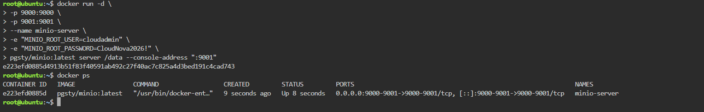
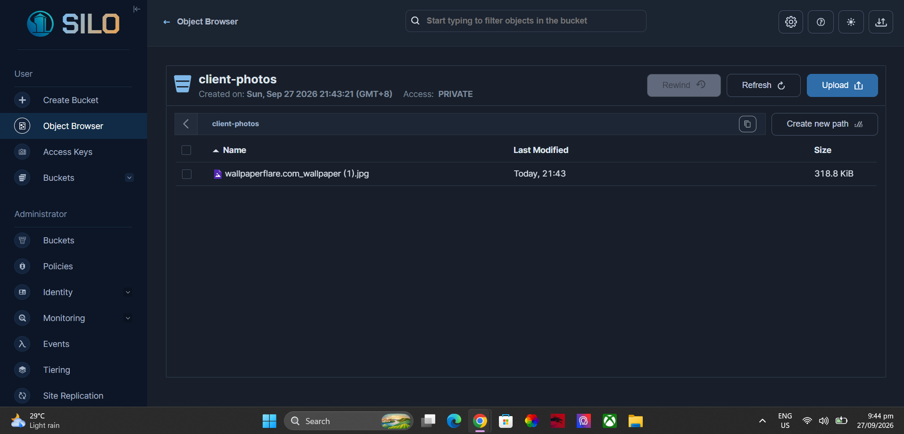

# MinIO Deployment and Cloud Storage Documentation

## Overview

In this activity, I deployed an object storage server using Docker. I used MinIO to create a cloud storage environment where files can be stored as objects.

I used the KillerCoda Ubuntu Playground to run the server and accessed the MinIO Web Console through a web browser.

## Step 1: Deploy MinIO

I used the following Docker command:

```bash
docker run -d \
-p 9000:9000 \
-p 9001:9001 \
--name minio-server \
-e "MINIO_ROOT_USER=cloudadmin" \
-e "MINIO_ROOT_PASSWORD=CloudNova2026!" \
pgsty/minio:latest server /data --console-address ":9001"
```

The `docker run` command creates and starts a container.

The `-d` option runs the container in the background.

The `-p 9000:9000` option connects port 9000 of the computer to port 9000 inside the container.

The `-p 9001:9001` option connects port 9001 of the computer to port 9001 inside the container.

The `--name minio-server` option gives the container the name `minio-server`.

## Step 2: Environment Variables

The `-e` options are used to set environment variables for the MinIO container.

The first environment variable is:

```text
MINIO_ROOT_USER=cloudadmin
```

This sets the administrator username.

The second environment variable is:

```text
MINIO_ROOT_PASSWORD=CloudNova2026!
```

This sets the administrator password.

These values are used when logging in to the MinIO Web Console.

## Step 3: Verify the Container

I used the following command to check if the MinIO container was running:

```bash
docker ps
```

The container name was:

```text
minio-server
```

The container used ports 9000 and 9001.

## Step 4: Access the Web Console

The MinIO Web Console was accessed using:

```text
Port: 9001
```

I used the KillerCoda Traffic or Custom Ports feature and entered port `9001`.

After clicking Access, the MinIO Web Console opened in the browser.

## Step 5: Login

I used the following login information:

```text
Username: cloudadmin
Password: CloudNova2026!
```

## Step 6: Create the Bucket

After logging in, I opened the Buckets section and created a bucket named:

```text
client-photos
```

The bucket is used to organize the files uploaded for the photo-sharing application.

## Step 7: Upload a File

I opened the `client-photos` bucket and used the Upload button to upload a sample file.

The uploaded file appeared inside the bucket. This showed that the object storage system was working.

## Ports Used

| Port | Purpose |
|---|---|
| 9000 | MinIO API |
| 9001 | MinIO Web Console |

## Bucket Created

The bucket created in this activity was:

```text
client-photos
```

## Screenshots

### MinIO Container



### Bucket and Uploaded File



## Conclusion

The MinIO object storage server was successfully deployed using Docker. I was able to run the server, access the Web Console, create the `client-photos` bucket, and upload a sample file. This activity helped me understand how Docker and object storage can be used together in cloud computing.
